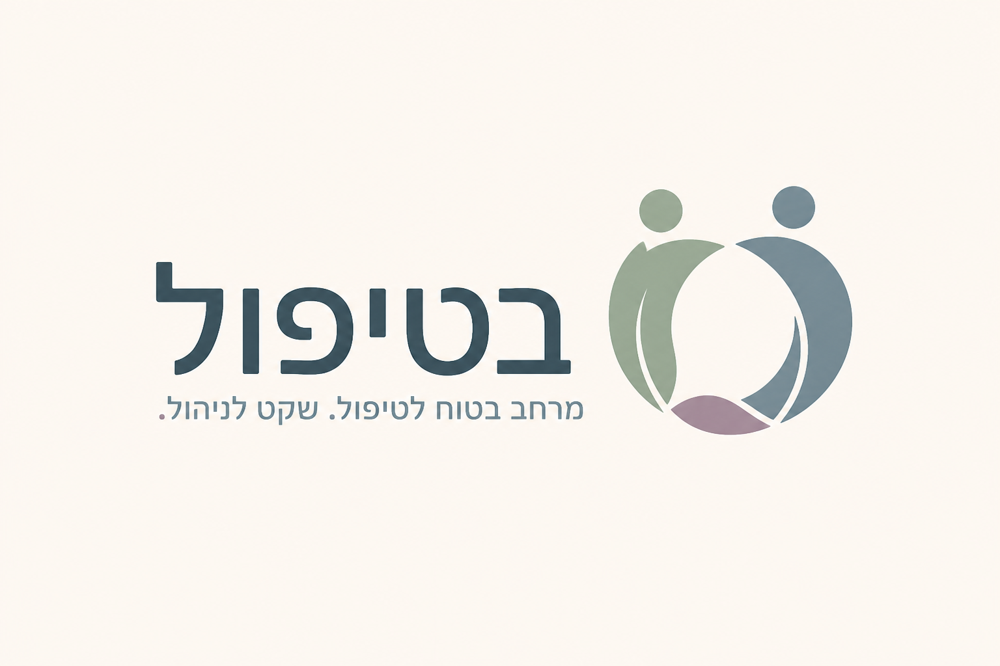

# בטיפול



**בטיפול** היא סביבת עבודה מקומית למטפלים פרטניים, זוגיים ומשפחתיים, הארוזה כ־Home Assistant App. המערכת כוללת ממשק RTL רספונסיבי, תיקי טיפול מרובי משתתפים, יומן, רשומות קליניות, עבודה מול גופים, מעקב כספי, הרשאות, Audit וגיבויים מוצפנים ל־Synology.

## מצב הפרויקט

גרסה `0.1.7` היא תשתית MVP ניסיונית. אין להשתמש בה כרגע כתחליף למערכת קלינית או חשבונאית מאושרת לפני בדיקת אבטחה, בדיקות שחזור, אפיון משפטי ואימות מקצועי.

## עקרונות אבטחה

- PostgreSQL פעיל נשמר מקומית תחת `/data`; הוא אינו רץ על SMB/NFS.
- שמות ופרטים מזהים, תכנים קליניים, קישורי פגישה ומידע רגיש מוצפנים ב־AES‑256‑GCM לפני כתיבה למסד.
- גיבויים ל־`/share` מוצפנים בנפרד ב־AES‑256‑GCM עם מפתח הנגזר באמצעות scrypt.
- הרשאות קליניות מופרדות מהרשאות משרד וכספים.
- רשומות Audit הן append-only ברמת מסד הנתונים.
- הפורט העצמאי כבוי כברירת מחדל. Ingress מוגבל ל־Home Assistant Supervisor.

הצפנת שדות מגינה על dump או גישה מקרית למסד, אך מפתח השדות נמצא על אותו host כדי שהיישום יוכל לפענח. לכן נדרשים גם הצפנת הדיסק של ה־host, אבטחת חשבון HA, גיבוי מפתח והגנה פיזית.

## Synology

1. יש לחבר ב־Home Assistant את תיקיית הרשת של Synology כ־Network Storage מסוג Share.
2. בהגדרות ה־App יש להחליף את `backup_passphrase` בערך ארוך וייחודי ולשמור אותו במנהל סיסמאות נפרד.
3. במסך **אבטחה והגדרות** יש לבחור נתיב יחסי, למשל `BETIPUL/Backups`.
4. יש ליצור גיבוי ידני ולהפעיל **בדיקת תקינות**.

אובדן סיסמת הגיבוי או מפתח השדות ימנע שחזור. אין לשמור אותם רק על אותו Synology.

## כספים בישראל

ה־MVP מנהל חיובים, תשלומים, יתרות וגופים מממנים בלבד. הוא אינו מפיק חשבונית מס, קבלה או יומן רופא רשמי. הפקת מסמכי מס תתווסף רק באמצעות אינטגרציה לספק ישראלי רשום או לאחר רישום התוכנה וקבלת ייעוץ רו״ח. הדרישות למספרי הקצאה ב״חשבוניות ישראל״ משתנות לפי מועד וסכום ולכן אינן מקודדות כברירת מחדל.

## פיתוח מקומי

```powershell
cd betipul
pnpm install
pnpm run dev
```

ה־API מצפה ל־PostgreSQL. באריזת Home Assistant הוא עולה אוטומטית בתוך ה־App.

## התקנה ב־Home Assistant

הוסיפו את `https://github.com/r11a/BETIPUL` כמאגר Apps מותאם, התקינו **בטיפול**, החליפו את סיסמאות ברירת המחדל ורק אז הפעילו. גישה עצמאית מחוץ ל־Ingress מחייבת HTTPS או VPN ואינה מופעלת כברירת מחדל.

## מסמכים

- [מודל אבטחה](docs/SECURITY.md)
- [מפת מוצר והשוואת שוק](docs/PRODUCT.md)
- [רשימת מוכנות לישראל](docs/ISRAEL-COMPLIANCE.md)

## רישיון

זהו מוצר קנייני ואינו קוד פתוח. כל הזכויות שמורות. אין להעתיק, לשנות, להפיץ, למכור, לארח או ליצור יצירה נגזרת ללא אישור מפורש מראש ובכתב. ראו [LICENSE](LICENSE).
